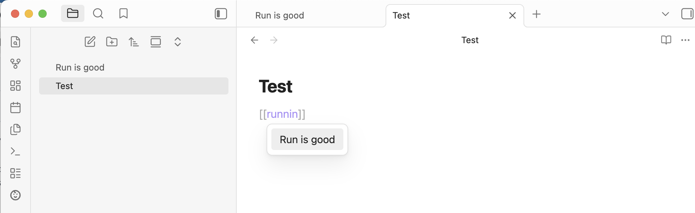

*Читайте на [русском](README.ru.md).*

# Natural link

An Obsidian plugin that lets you create links to notes using natural word forms. Type a word in any grammatical form and the plugin will find matching notes regardless of declension, conjugation, or word order.


*Experimental feature: replaces the standard inline link suggestions with the plugin's morphological search (can be enabled in the plugin settings):*


## Features

- **Morphological search**: Find notes by any word form. Searching for "wooden boxes" will match a note titled "Wooden box".
- **Prefix matching**: Results update as you type. Even incomplete words match — typing "wood" will find "Wooden box".
- **Alias support**: Searches across note titles and frontmatter aliases.
- **Word order independence**: "box wooden" finds "Wooden box".
- **Multi-language**: Russian and English stemming work simultaneously. The plugin determines word stems algorithmically, no dictionaries required.
- **Heading and block links**: Use `#` to link to a specific heading (`note#heading`) or `^` to link to a block (`note^text`). The plugin searches for the note first, then shows matching headings or text blocks with previews. For `^`, all text blocks in the note are shown — blocks with existing IDs display them, and blocks without IDs get a unique one generated automatically. Use `|` to set explicit display text (`note|custom text`).
- **Insert link as typed**: Press **Shift+Enter** to insert a link with your exact input as both target and display text, bypassing search results.
- **Preserved display text**: Links are always created as `[[Note Title|your input]]`, so your original text is preserved even if the note is renamed.
- **Inline `[[` suggest** (opt-in): Replace Obsidian's native link autocomplete with the plugin's morphological search. Suggestions appear inline as you type `[[`, with hotkey hints shown at the bottom. Enable in Settings → Natural link → "Replace native [[ link suggest".
- **Localized UI**: Interface available in English and Russian. Language follows your Obsidian settings.

## Usage

1. Open the command palette (Cmd/Ctrl+P) and run **Insert Natural link**, or use your assigned hotkey.
2. Start typing the word or phrase you want to link.
3. Select a matching note from the suggestions and press **Enter**.
4. The plugin inserts a wikilink: `[[Matched Note|your typed text]]`.

**Tip**: Press **Shift+Enter** at any time to insert a link using your exact input as-is, bypassing search results. The result is `[[your typed text|your typed text]]`.

### Recommended hotkey

The plugin does not assign a hotkey by default. We recommend **Cmd/Ctrl+Shift+K** (next to Cmd+K which is "Insert link" in Obsidian). To set it up:

1. Go to **Settings → Hotkeys**
2. Search for "Natural link"
3. Assign your preferred shortcut

You can also open the hotkey settings directly from the plugin's settings tab.

## Examples

| You type | Note found | Link created |
|----------|-----------|--------------|
| wooden boxes | Wooden box | `[[Wooden box\|wooden boxes]]` |
| box wooden | Wooden box | `[[Wooden box\|box wooden]]` |
| wood | Wooden box | `[[Wooden box\|wood]]` |

## Installation

### From Obsidian Community Plugins

> **Status**: The plugin has been submitted to the official community plugin list and is awaiting review. Once approved, it will be available directly from Obsidian.

1. Open **Settings → Community plugins → Browse**.
2. Search for **Natural link**.
3. Click **Install**, then **Enable**.

### Via BRAT (recommended while awaiting official listing)

[BRAT](https://github.com/TfTHacker/obsidian42-brat) (Beta Reviewers Auto-update Tester) lets you install plugins directly from GitHub and keeps them up to date automatically.

1. Install the **BRAT** plugin from Obsidian Community Plugins if you haven't already.
2. Open **Settings → BRAT → Add Beta plugin**.
3. Enter the repository URL: `https://github.com/rekby/obsidian-natural-link`
4. Click **Add Plugin**.
5. Enable **Natural link** in **Settings → Community plugins**.

BRAT will automatically check for updates and keep the plugin current.

### Manual installation

1. Download `main.js`, `manifest.json`, and `styles.css` from the [latest release](https://github.com/rekby/obsidian-natural-link/releases/latest).
2. Create a folder `<Vault>/.obsidian/plugins/obsidian-natural-link/`.
3. Copy the downloaded files into that folder.
4. Reload Obsidian and enable **Natural link** in **Settings → Community plugins**.

## Development

```bash
npm install          # Install dependencies
npm run dev          # Watch mode
npm run build        # Type check + production build
npm test             # Run tests
npm run test:watch   # Watch mode tests
npm run lint         # Lint
```

## Known limitations

- **Irregular word forms**: Snowball stemming is algorithmic and cannot connect words with irregular roots (e.g. "mouse" and "mice" produce different stems). Full lemmatization support is planned for a future release.
- **No typo tolerance**: Currently matches are exact on stems. Fuzzy matching is planned.

## License

[MIT](LICENSE)
