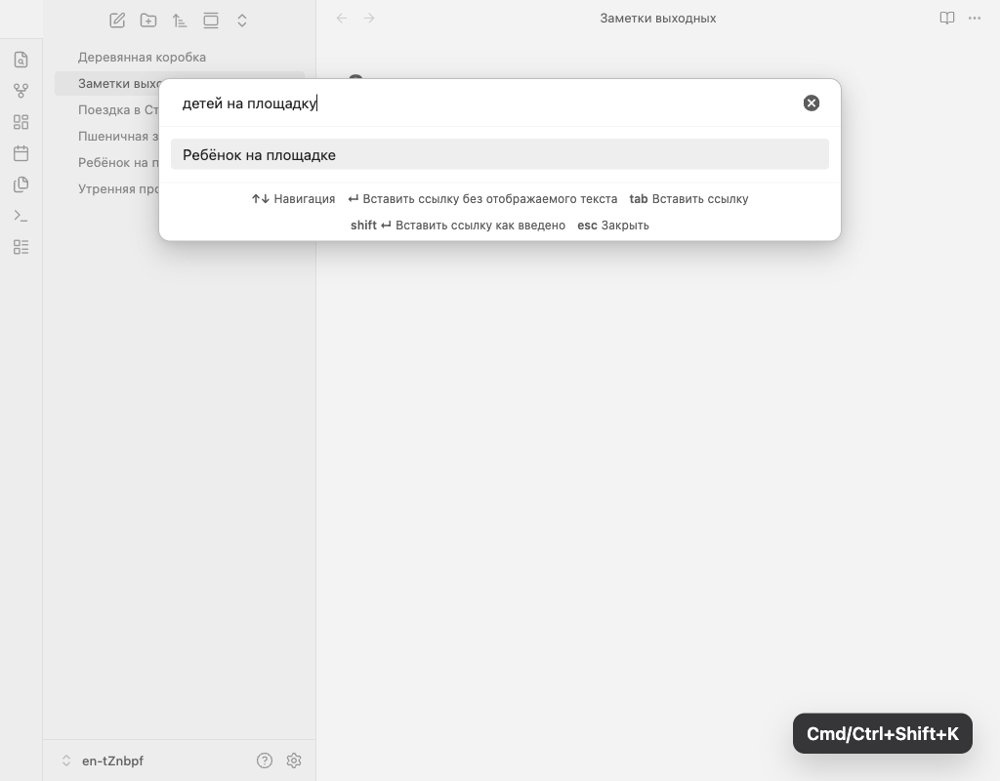
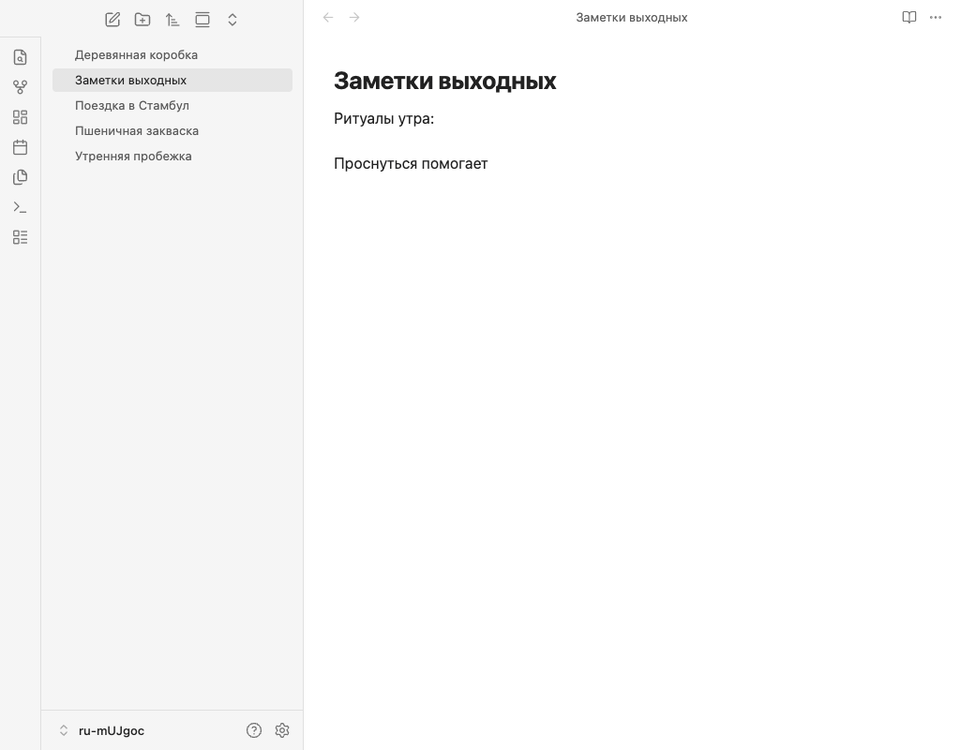
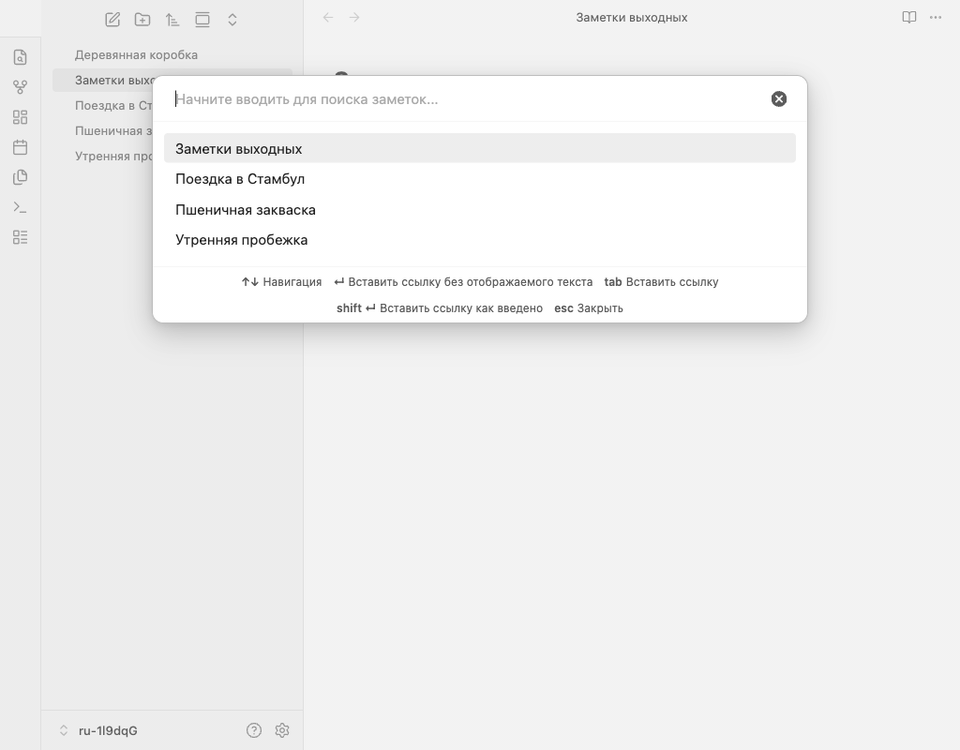
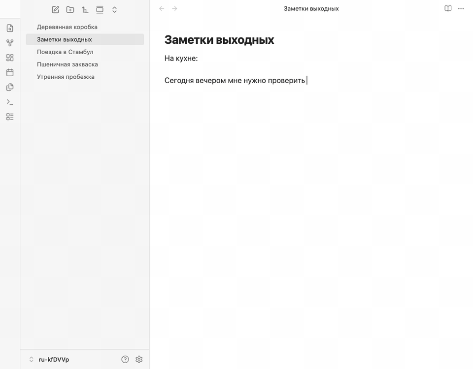

*Read this in [English](README.md).*

# Natural link

Плагин для Obsidian, позволяющий создавать ссылки на заметки, используя естественные формы слов. Введите слово в любой форме — плагин найдёт подходящие заметки независимо от порядка слов.



*Опциональная функция: подменяет стандартные подсказки во время ввода на подсказки плагина (включается в настройках плагина):*


## Возможности

- **Морфологический поиск**: Находите заметки по любой форме слова. Поиск по «деревянную коробку» найдёт заметку «Деревянная коробка». Также нормализуются русские чередования согласных (например, `друг`/`дружить`, `ходить`/`хожу`).
- **Поиск по префиксу**: Результаты обновляются по мере ввода. Даже неполные слова работают — ввод «кор» найдёт «Коробка».
- **Поддержка алиасов**: Поиск работает по заголовкам заметок и алиасам из frontmatter.
- **Независимость от порядка слов**: «коробку деревянную» найдёт «Деревянная коробка».
- **Мультиязычность**: Русский и английский поиск работают одновременно, словари не требуются.
- **Ссылки на заголовки и блоки**: Используйте `#` для ссылки на заголовок (`заметка#заголовок`) или `^` для ссылки на блок (`заметка^текст`). Плагин сначала ищет заметку, затем показывает подходящие заголовки или текстовые блоки с превью. Используйте `|` для явного отображаемого текста (`заметка|текст`).
- **Tab для сохранения видимого текста**: Нажмите **Tab**, чтобы принять выбранную подсказку и вставить ссылку с сохранением введенного текста (`[[Заметка|ваш текст]]`, `[[Заметка#Заголовок|ваш текст]]`, `[[Заметка#^blockId|ваш текст]]`).
- **Вставка ссылки как есть**: Нажмите **Shift+Enter**, чтобы вставить ссылку с точным вводом в качестве и цели, и отображаемого текста, минуя результаты поиска.
- **Сохранение отображаемого текста**: Ссылки всегда создаются в формате `[[Заголовок заметки|ваш ввод]]`, поэтому исходный текст сохраняется даже при переименовании заметки.
- **Встроенные подсказки `[[`** (опционально): Замените стандартное автодополнение ссылок Obsidian морфологическим поиском плагина. Подсказки появляются прямо в редакторе при вводе `[[`, с подсказками горячих клавиш внизу. Включите в Настройки → Natural link → «Заменить стандартные подсказки [[».
- **Локализованный интерфейс**: Интерфейс доступен на английском и русском языках. Язык определяется настройками Obsidian.

## Использование

1. Запустите команду **Insert Natural link** (или начните вводить `[[`, если функция встроенных подсказок включена).
2. Введите слово или фразу, на которую хотите сослаться.
3. Выберите подходящую заметку:
   - **Enter** вставляет `[[Найденная заметка]]`.
   - **Tab** вставляет `[[Найденная заметка|ваш текст]]` (также работает для `#`-заголовков и `^`-блоков).

**Совет**: Нажмите **Shift+Enter** в любой момент, чтобы вставить ссылку с точным вводом без поиска.

**Команды в палитре**:
- **Insert natural link** (рекомендуемая горячая клавиша: **Cmd/Ctrl+Shift+K**) — открывает диалог вставки естественной ссылки.
- **Переключить "Заменить стандартные подсказки [[ естественными"**
- **Включить "Заменить стандартные подсказки [[ естественными"**
- **Выключить "Заменить стандартные подсказки [[ естественными"**

Команды для встроенных подсказок позволяют управлять заменой стандартного автодополнения `[[` без перехода в настройки.

## Демонстрация

**Русские демо-сценарии**

**Поиск через модалку**
Натуральная фраза открывается через модалку и подтверждается `Tab`, чтобы сохранить введённый текст.


**Встроенные подсказки `[[`**
Ссылка набирается прямо в редакторе и подтверждается `Enter`.


**Ссылка на заголовок**
Сначала находится заметка, затем выбор сужается до заголовка через `#заголовок`.


**Ссылка на блок**
Поиск идёт по `^блоку`, затем вставляется ссылка на блок и показывается дописанный block ID в целевой заметке.


### Рекомендуемая горячая клавиша

Плагин не назначает горячую клавишу по умолчанию. Рекомендуем **Cmd/Ctrl+Shift+K** (рядом с Cmd+K — «Вставить ссылку» в Obsidian). Чтобы настроить:

1. Перейдите в **Настройки → Горячие клавиши**
2. Найдите «Natural link»
3. Назначьте удобное сочетание клавиш

Открыть настройки горячих клавиш можно также из вкладки настроек плагина.

## Примеры

| Вы вводите | Найденная заметка | Созданная ссылка |
|----------|-----------|--------------|
| деревянную коробку | Деревянная коробка | `[[Деревянная коробка\|деревянную коробку]]` |
| коробку | Деревянная коробка | `[[Деревянная коробка\|коробку]]` |
| кор | Коробка | `[[Коробка\|кор]]` |

## Установка

### Из каталога плагинов Obsidian

> **Статус**: Плагин отправлен на рассмотрение в официальный каталог плагинов сообщества. После одобрения он будет доступен прямо из Obsidian.

1. Откройте **Настройки → Сторонние плагины → Обзор**.
2. Найдите **Natural link**.
3. Нажмите **Установить**, затем **Включить**.

### Через BRAT (рекомендуется, пока плагин не в каталоге)

[BRAT](https://github.com/TfTHacker/obsidian42-brat) (Beta Reviewers Auto-update Tester) позволяет устанавливать плагины напрямую из GitHub и автоматически обновлять их.

1. Установите плагин **BRAT** из каталога плагинов Obsidian, если ещё не установлен.
2. Откройте **Настройки → BRAT → Add Beta plugin**.
3. Введите URL репозитория: `https://github.com/rekby/obsidian-natural-link`
4. Нажмите **Add Plugin**.
5. Включите **Natural link** в **Настройки → Сторонние плагины**.

BRAT будет автоматически проверять обновления и поддерживать плагин в актуальном состоянии.

### Ручная установка

1. Скачайте `main.js`, `manifest.json` и `styles.css` из [последнего релиза](https://github.com/rekby/obsidian-natural-link/releases/latest).
2. Создайте папку `<Хранилище>/.obsidian/plugins/obsidian-natural-link/`.
3. Скопируйте скачанные файлы в эту папку.
4. Перезагрузите Obsidian и включите **Natural link** в **Настройки → Сторонние плагины**.

## Разработка

```bash
npm install          # Установка зависимостей
npm run dev          # Режим наблюдения
npm run build        # Проверка типов + продакшен-сборка
npm test             # Запуск тестов
npm run test:watch   # Тесты в режиме наблюдения
npm run obsidian-tests # Реальные UI-тесты в Obsidian
npm run demo:screenshots # Захват статичных PNG-скриншотов для README
npm run demo:capture # Захват кадров для локализованных демо
npm run demo:render  # Сборка GIF из кадров через ffmpeg
npm run demo         # Полное обновление PNG-скриншотов и GIF для README
npm run lint         # Линтинг
```

## Известные ограничения

- **Нерегулярные формы**: Плагин пока не связывает слова с полностью разными корнями (например, «человек» и «люди»).
- **Нет толерантности к опечаткам**: Сейчас совпадения точные по корням слов. Нечёткий поиск запланирован.

## Лицензия

[MIT](LICENSE)
